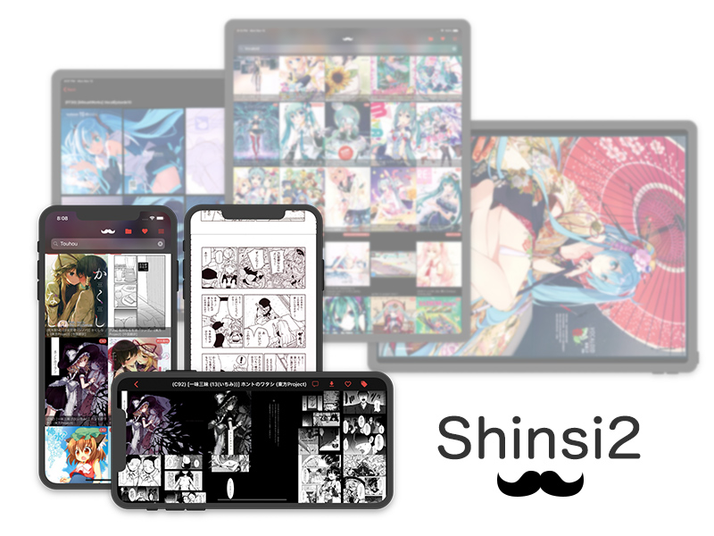
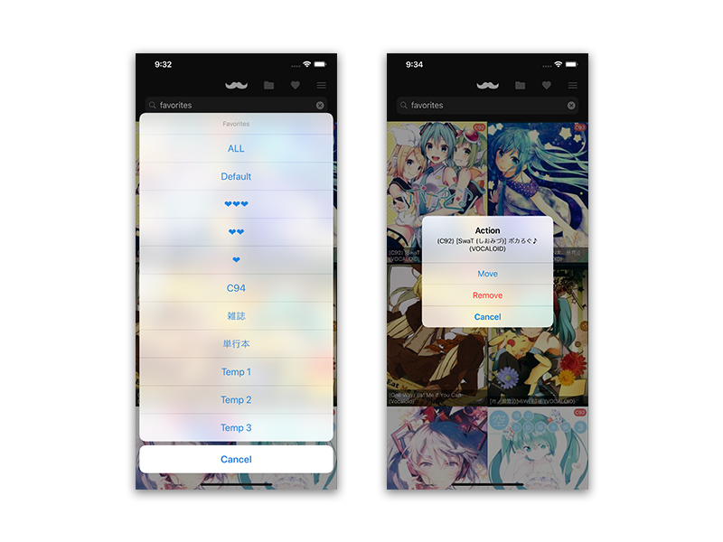
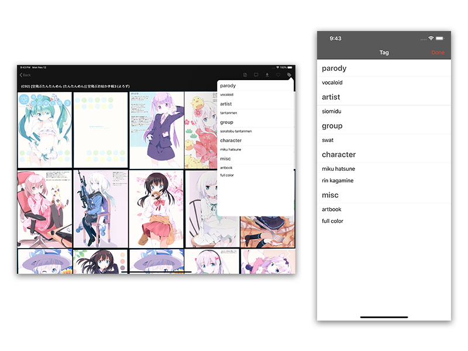
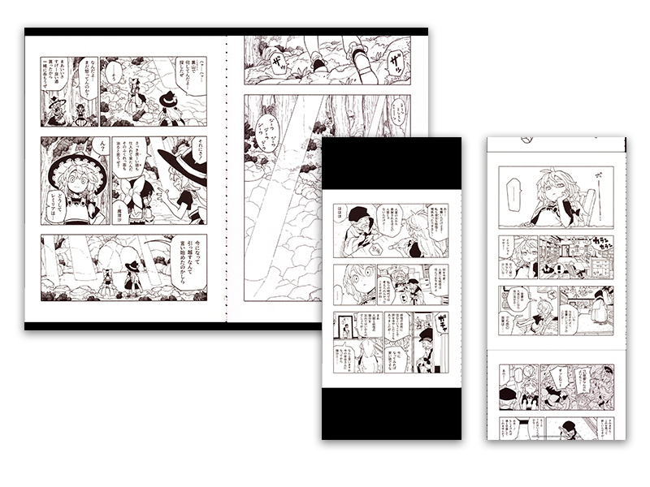

[](https://app.bitrise.io/app/e86f4f4671dc9fef)

# Shinsi2

An unofficial iOS app for E-Hentai / EX-Hentai. Fully supporting iOS devices of any size. Written in Swift 5.0





## Features

### Modern and Fast 🚄

* Caches and pre-loaded images, view without stress
* Thumbnail preview
* Smooth transitions between pages
* Interactive gestures
* All orientations supported, iPad Split View supported

### Search / Search History
* Supporting category filter
* `keyword p:10` to skip 10 pages
* `favorites` to get all favorites, or `favorites0~9` to get specific favorite folder
* `popular` to show popular galleries
* `download` to get downloaded galleries
* Swipe left to delete history

### Favorites
* Enter `favorites` in search bar, or click right top ❤︎
* In a gallery page, click right top ❤︎ to add the gallery to Favorites (always adding to Favorites0)
* In Favorites, long press to move/remove favorites
* Supporting custonm folder name



### Downlaod
* Download
* Download part of a gallery
* Background downloading not supported

### Tag
* Tap to search tag



### Viewer

* View in portrait or landscape
* Double Page Viewer (iPad only)



### More

* View comments
* Links in comments supported
* Pinch in/out to change thumbnail size
* 3D touch support, quick preview galleries
* Quick scroll 

## Enviroment

* XCode 11.4
* Swift 5
* Cocoapods

## Installation

### iOS 11+ required

### XCode

Clone the project, run `pod install`. Use XCode to build it to your device.

By default, a Cocoapods mirror in Tsinghua University is used. If you are out of China, you may comment out the following line in [Podfile](Podfile) for faster Cocoapods installation:

```
source 'https://mirrors.tuna.tsinghua.edu.cn/git/CocoaPods/Specs.git'
```

### Cydia Impactor

Download ipa from [release](https://github.com/powhu/Shinsi2/releases). Use Cydia Impactor to reassign ipa.
You can google "Cydia Impactor" for more information.

## Support

You can ask me questions in English/Chinese.

可以使用中文向我詢問。

It would be very helpful if you could help me with my grammar and spelling.

## Change log

* **ver 1.4.1** 2020/4/20
  * Bug fix

* **ver 1.4** 2020/4/20
  * Reading History
  * Add shortcut

* **ver 1.3** 2020/4/3
  * iOS 13 support
  * Bug fix

* **ver 1.1** 2018/11/14
	* Comment links
	* Web login
	* UI fix
* **ver 1.0** First release. 2018/11/12

## Legal

Copyright © 2018 PowHu Yang. Released under the MIT license.

## Third Party Library

Shinsi2 uses the following awesome open sources.

* RealmSwift
* Alamofire
* Kanna
* SDWebImage
* SVProgressHUD
* Hero
* AloeStackView
